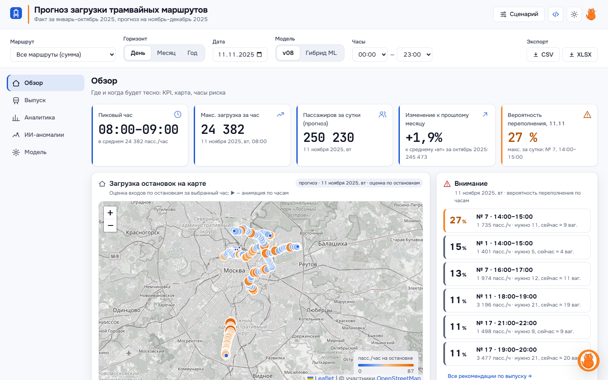

# Прогноз загрузки трамвайных маршрутов Москвы

Почасовой прогноз посадок на 10 трамвайных маршрутах на ноябрь–декабрь 2025 года и веб-сервис для диспетчеров: карта загрузки, выпуск подвижного состава, сценарии «что если», интервалы прогноза, детектор аномалий и помощник на естественном языке.

<p align="center">
  
</p>

## Результат

| Показатель | Значение |
|---|---|
| WAPE-score, публичный лидерборд | **0,90167** (baseline организаторов ≈ 0,48) |
| Локальная валидация | октябрь — 0,908 · среднее по 6 скользящим фолдам ≈ 0,87 · hold-out янв–авг → сен–окт — 0,821 |
| Финальный прогноз | [`submissions/FINAL_SUBMISSION.csv`](submissions/FINAL_SUBMISSION.csv) — 14 640 строк: 10 маршрутов × 61 день × 24 часа |
| Сервис | 2 vCPU / 2 ГБ: ≈ 2 300–2 700 запросов/с, p95 17–63 мс; 77 автотестов |

## Как устроен прогноз

```
прогноз(маршрут, дата, час) = уровень(маршрут, тип дня) × профиль(маршрут, тип дня, час)
                              × особый день × погода × события
```

- **Уровень** — типичный пассажиропоток маршрута за день по последним «чистым» неделям, без каникул и праздников.
- **Профиль** — распределение поездок по часам: утренний и вечерний пики каждого маршрута.
- **Особый день** — праздники, переносы, предновогодние дни (производственный календарь РФ).
- **Погода** — осадки и сильный мороз снижают поездки.
- **События** — запуск маршрута 5 (16.12), окончание ремонта на выходных для маршрутов 7 и 50 (15.11), бесплатный проезд в новогоднюю ночь.

Каждое число в прогнозе раскладывается на эти множители и показывается диспетчеру. Подробнее — [docs/model.md](docs/model.md).

## Документация

| Документ | О чём |
|---|---|
| [docs/model.md](docs/model.md) | модель, почему выбрана она, ML-компоненты, валидация, область применимости |
| [docs/data_sources.md](docs/data_sources.md) | внешние источники: ссылки, признаки, подтверждённый эффект |
| [docs/experiments.md](docs/experiments.md) | путь от 0,48 до 0,90: что проверяли и почему оставили или отказались |
| [service/README.md](service/README.md) | веб-сервис: запуск, API, производительность, интерфейс |
| [docs/DATASET_README.md](docs/DATASET_README.md) | описание датасета от организаторов |

## Быстрый старт

```bash
cd service
docker compose up --build        # http://localhost:8000 — дашборд, /docs — API
```

Без Docker:

```bash
cd service
pip install -r requirements-dev.txt
uvicorn app.main:app --port 8000
pytest -q                        # 77 тестов
```

Пересчёт прогноза из исходных данных (нужны `train.csv` и `test.csv` организаторов в корне):

```bash
pip install pandas numpy duckdb openpyxl statsmodels lightgbm
python src/pipeline_ingest.py                           # 62,4 млн валидаций → почасовые агрегаты, сверка с разметкой
python src/pipeline_geo.py                              # привязка остановок, отчёт о качестве данных
python src/make_final.py --no-weather --name final      # = FINAL_SUBMISSION.csv
```

## Структура

```
src/                  данные → признаки → модель → итоговый прогноз
  pipeline_ingest.py  приём и нормализация сырых валидаций (DuckDB)
  pipeline_geo.py     геопривязка остановок, отчёт о качестве
  model_ls.py         модель «уровень × профиль»
  build_submission.py календарь и особые дни
  adjust.py           погода, события, чистый уровень
  make_final.py       сборка прогноза
  ml/                 гибрид с LightGBM, интервалы P10–P90, детектор аномалий
research/             календарь, погода, пробки (CSV)
experiments/          промежуточные расчёты, используемые пайплайном
submissions/          итоговый прогноз и разложение по множителям
service/              API (FastAPI) и дашборд (Leaflet + ECharts)
```
