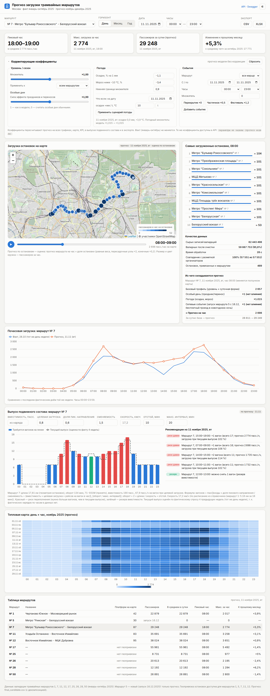
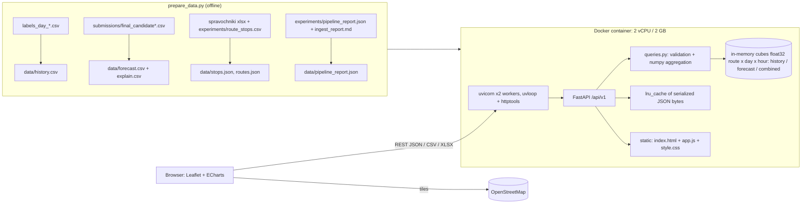

# Tram load forecast service (Moscow)

A web service and dashboard for Moscow dispatchers. It shows the forecast of tram passenger load (boardings/validations) by route, by stop and by hour, and puts it on a Moscow map. The backend is FastAPI with in-memory numpy cubes. The frontend is a single static page (Leaflet + ECharts) served by the same process. Everything runs in one container (2 vCPU / 2 GB).

- Dashboard: `http://localhost:8000/`
- OpenAPI / Swagger: `http://localhost:8000/docs`
- Data: actual counts Jan–Oct 2025 (`labels_day_*`), forecast Nov–Dec 2025 (`submissions/final_candidate.csv`), plus an optional forecast decomposition (`final_candidate_explain.csv`)



## Run

```bash
# 1) (optional) rebuild the data bundle from the workspace; service/data/ is already committed
python scripts/prepare_data.py            # defaults: ../submissions/final_candidate.csv (+ _explain.csv)
python scripts/prepare_data.py --forecast ../submissions/other.csv --explain ""   # another forecast, no decomposition

# 2) Docker (2 vCPU / 2 GB limits are set in docker-compose.yml)
docker compose up --build
# -> http://localhost:8000

# 3) Without Docker
pip install -r requirements.txt
uvicorn app.main:app --port 8000 --workers 2
```

Environment variables:

| Variable | Default | Meaning |
|---|---|---|
| `FORECAST_PATH` | `data/forecast.csv` | forecast `route;date;hour;prediction` |
| `EXPLAIN_PATH` | `data/explain.csv` | optional `route;date;hour;base;<factor>_mult…;prediction;note`. If it is missing, the explain panel is hidden and `/explain` returns `available:false` |
| `HISTORY_PATH` | `data/history.csv` | actuals `route;date;hour;boardings` |
| `STOPS_PATH`, `ROUTE_NAMES_PATH`, `PIPELINE_REPORT_PATH` | `data/*.json` | stop geometry, route names, data-quality report |
| `WORKERS` | `2` | uvicorn workers (1 per vCPU gave the best p95) |
| `TRACKED_ROUTES` | `1,5,7,11,12,17,25,26,28,50` | routes shown in the UI |

To swap the forecast without rebuilding the image, uncomment the `volumes` / `FORECAST_PATH` lines in `docker-compose.yml`.

Tests: `pip install -r requirements-dev.txt && pytest -q` (21 tests: valid requests, and 4xx errors with Russian messages).

## API (`/api/v1`)

All responses are JSON (orjson). Errors have one shape: `{"error": {"code", "message", "details"}}`. The `message` is in Russian and readable by a person.

| Endpoint | Purpose |
|---|---|
| `GET /routes` | routes, names, has_data / has_history / has_geometry, launch_date (route 5), data coverage |
| `GET /stops?route=7` | route stops with coordinates, direction, stop share; polylines |
| `GET /forecast?route=7&date_from=2025-11-10&date_to=2025-11-16&hour_from=6&hour_to=10&granularity=hour\|day\|month` | forecast series + summary (total, avg/day, max hour, peak hour, hourly profile). `route=all` or `route=7,11` aggregate routes |
| `GET /history?...` | the same, for actuals Jan–Oct 2025 |
| `GET /series?source=history\|forecast\|combined&...` | one series (actuals where available, forecast afterwards) |
| `GET /forecast/stop?stop_id=8630&date_from=...` | stop-level estimate (sums every route serving the stop) |
| `GET /map?route=all&date=2025-11-11` | map layer: every stop with 24 hourly values for a date (the dashboard animates hours on the client) |
| `GET /kpi?route=7&date_from=...&date_to=...` | peak hour, max hourly load, total, change vs the previous month (for one day: vs the same weekday of the previous month) |
| `GET /scenario/year?route=7&growth=3` | yearly **scenario** (see below) |
| `GET /explain?route=7&date=2025-12-01` | forecast decomposition per hour: `base × special_mult × weather_mult × rules_mult` |
| `GET /export?format=csv\|xlsx&source=forecast&route=all&granularity=hour&...` | download (CSV with `;` and UTF-8 BOM for Excel; XLSX with a "Параметры" sheet) |
| `GET /pipeline/report` | data-quality report of the ingest pipeline |
| `GET /health`, `GET /metrics` | readiness; per-worker request counters, latency histogram, cache hits |

Examples:

```bash
curl "localhost:8000/api/v1/forecast?route=7&date_from=2025-11-11&date_to=2025-11-11&granularity=hour"
curl "localhost:8000/api/v1/kpi?route=all&date_from=2025-12-01&date_to=2025-12-31"
curl -o nov.xlsx "localhost:8000/api/v1/export?format=xlsx&route=all&date_from=2025-11-01&date_to=2025-11-30&granularity=day"

curl "localhost:8000/api/v1/forecast?route=99"
# 404 {"error":{"code":"route_not_found","message":"Маршрут «99» не найден. Доступные маршруты: 1, 5, 7, 11, 12, 17, 25, 26, 28, 50","details":{}}}
curl "localhost:8000/api/v1/forecast?hour_from=abc"
# 422 {"error":{"code":"validation_error","message":"Параметр «hour_from» должен быть целым числом",...}}
curl "localhost:8000/api/v1/forecast?date_from=2025-05-01"
# 400 {"error":{"code":"out_of_range","message":"Данные «прогноз» доступны только с 2025-11-01 по 2025-12-31; запрошено 2025-05-01 — 2025-05-01",...}}
```

## Dashboard

- **Filters** (one row, sticky): route (or all routes), horizon **День / Месяц / Год**, date or month, hour interval, CSV/XLSX export of exactly what is selected.
- **KPIs**: «Пиковый час», «Макс. загрузка за час», passengers for the period, «Изменение к прошлому месяцу».
- **Map** (OSM + Leaflet): stops coloured and sized by the estimated boardings for the selected hour. There is a time slider and a ▶ button that animates the 24 hours. Clicking a stop opens a popup and the stop's own chart. Routes 17, 25, 26, 28 and 50 have no stop geometry in the directory: the map shows «Геопривязка остановок недоступна для маршрута», and these routes appear in the charts and the table only.
- **Top-10 stops** for the selected hour. **Качество данных**: 62.4M raw validations → 59.7M valid, 28 s, 100% match with the organizer labels. **Из чего складывается прогноз**: the decomposition for the selected route, date and hour.
- **Line chart**: day view = hourly forecast vs the last actual day with the same weekday. Month view = daily series of actuals and forecast with the selected month highlighted. Year view = monthly average day (actual / forecast) plus the scenario line.
- **Heatmap** day × hour (month × hour in year view), and a **route table** (click a row to select that route).
- Light/dark theme (follows the OS, toggle ◐). Mobile layout checked at 390 px with no horizontal scroll.

Screenshots: `docs/screenshots/` (`day_all_light.png`, `day_all_dark.png`, `day_route7.png`, `month_route7.png`, `year_route7.png`, `day_route5_new.png`, `day_route17_nogeo.png`, `mobile.png`). To regenerate them: `python scripts/screenshots.py http://localhost:8000`.

### Method notes (be transparent with the jury)

- **Stop-level numbers are an estimate.** The data has route × hour counts only. A stop gets `route forecast × stop share`. The share is the pipeline weight from `experiments/route_stops.csv` (equal per stop) × a heuristic: transfer hubs (метро/МЦД/МЦК/вокзал) ×2, and the last stop of a direction ×0.1 (people get off there). Shares are normalised per route. The UI labels these values «оценка».
- **Route 5** is new (Рижская – Белорусский вокзал). It has forecast from 2025-12-16 and no history. `/history` and the year scenario for it return a clear 404 or 400. Before its launch date the map shows a "launch" overlay.
- **Year horizon = scenario, not the model.** The seasonal index of month *m* is the average day of *m* in 2025 (Jan–Oct actual, Nov–Dec forecast) divided by the mean over the year. The 2026 scenario = the 2025 average level × index × (1 + growth %) × days in the month. The growth % can be changed in the UI.

## Architecture



- At startup each worker loads about 75k rows into three dense `float32` cubes `[route, day, hour]` (about 0.3 MB each). Every query is a numpy slice plus a reduction, so it is O(requested cells).
- Responses are cached as serialized bytes (`lru_cache`, 4096 entries). The data is immutable after startup, so the cache can never be stale. Swapping the forecast means a restart.
- The metrics middleware is plain ASGI (no `BaseHTTPMiddleware` overhead). Access log is off. GZip is on for responses > 2 KB.

## Performance (measured)

Load generator: `scripts/loadtest.py`. It is a closed loop: aiohttp, N processes × M connections, 30 s per run. The mix of requests follows what the dashboard sends: 30% `/forecast` (random route/date/granularity/hours), 15% `/history`, 20% `/kpi`, 15% `/map`, 10% `/forecast/stop`, 5% `/routes`, and 5% intentionally invalid requests (they return 400 through the validation path). Routes and dates are random, so the cache warms up during the run.

### Docker container (2 vCPU / 2 GB): not measured yet

On the build machine, Docker Desktop 4.60 crashes at startup, so the engine never comes up: `initializing Inference manager: ... remove %LOCALAPPDATA%\Docker\run\dockerInference: The file cannot be accessed by the system`. The cause is a stale AF_UNIX socket file under a user profile path with Cyrillic characters. The fix is on the host, outside this project, so I did not apply it:

```powershell
# quit Docker Desktop first, then:
Remove-Item -Force "$env:LOCALAPPDATA\Docker\run\dockerInference", "$env:LOCALAPPDATA\Docker\run\userAnalyticsOtlpHttp.sock"
# (if Remove-Item refuses: cmd /c del /f /q "%LOCALAPPDATA%\Docker\run\dockerInference")
# or disable "Docker Model Runner" in Docker Desktop settings; then start Docker Desktop again
```

Once Docker is running, one command builds the container, runs the same load test and samples `docker stats` (CPU %, RAM). Results go to `docs/loadtest_docker_*.json`:

```powershell
powershell -ExecutionPolicy Bypass -File scripts\bench_docker.ps1
```

| Run (container) | Connections | RPS | p50 ms | p95 ms | p99 ms | CPU % avg / max (docker stats) | RAM max |
|---|---|---|---|---|---|---|---|
| docker_16c | 16 | _pending_ | | | | | |
| docker_64c | 64 | _pending_ | | | | | |
| docker_256c | 256 | _pending_ | | | | | |

### Measured: same service, 2-vCPU limit emulated on the Windows host

`scripts/bench_windows.ps1` starts uvicorn and pins the whole process tree (master + workers) to **2 logical CPUs** (affinity mask 0x3). This is the same CPU budget as `cpus: 2`. CPU is sampled from process CPU time (200% = both cores busy). RAM is the working set of the tree. The load generator runs on the other cores of the same machine (Intel Core Ultra 5 225H, 14 logical CPUs, 32 GB, Windows 11, Python 3.12).

| Run | Workers | Connections | RPS | p50 ms | p95 ms | p99 ms | CPU % avg / max (of 200%) | RAM max (MB) | Errors |
|---|---|---|---|---|---|---|---|---|---|
| win_2cpu_2w_16c | 2 | 16 | **3 291** | 3.7 | **12.6** | 19.8 | 151 / 195 | 331 | 0 (5% are intended 400s) |
| win_2cpu_2w_64c | 2 | 64 | **3 634** | 14.1 | **44.9** | 67.6 | 153 / 196 | 368 | 0 |
| win_2cpu_2w_256c | 2 | 256 | **3 369** | 43.3 | **189.1** | 219.5 | 153 / 197 | 459 | 0 |
| win_2cpu_4w_64c | 4 | 64 | 3 268 | 11.9 | 58.2 | 111.6 | 152 / 199 | 633 | 0 |

(The CPU average includes about 2 s of idle warm-up and cool-down samples. While the load runs, CPU sits at 185–200%, i.e. the 2-CPU limit is saturated.)

What this means against the requirement (hundreds of RPS, p95 < 200–300 ms, 2–4 vCPU / 2–4 GB):

- **Throughput is about 3.3–3.6k RPS on 2 CPUs**, roughly 10× the "hundreds of RPS" target. p95 stays under **45 ms at 64 concurrent connections** and under 200 ms even at 256 connections, with the CPU saturated.
- **RAM is 330–460 MB** for master + 2 workers, well inside the 2 GB limit.
- 2 workers (1 per vCPU) beat 4 workers on p95 and RAM, so the container default is `WORKERS=2`.
- Linux in the container adds `uvloop`, which Windows does not have, so the container numbers are expected to be the same or better. They still need to be confirmed with `bench_docker.ps1` (see above).

## Project layout

```
service/
  app/            main.py (routes), queries.py (logic), store.py (loading), errors.py, metrics.py, config.py
  static/         index.html, app.js, style.css (no build step; Leaflet/ECharts from jsDelivr)
  data/           prepared data bundle (history, forecast, explain, stops, routes, pipeline report, meta)
  scripts/        prepare_data.py, loadtest.py, bench_docker.ps1, bench_windows.ps1, screenshots.py
  tests/          pytest API tests
  docs/           screenshots, raw load-test JSON
  Dockerfile, docker-compose.yml, requirements*.txt
```

## Known gaps

- Container performance has not been measured on this machine yet, because Docker Desktop does not start (see above). The table above comes from an emulated 2-CPU limit on the host.
- Stop-level values are a heuristic split of the route forecast. There is no stop-level ground truth.
- The map and CDN libraries need internet access in the browser (OSM tiles, jsDelivr).
- `/metrics` counters are per worker process (no shared store).
