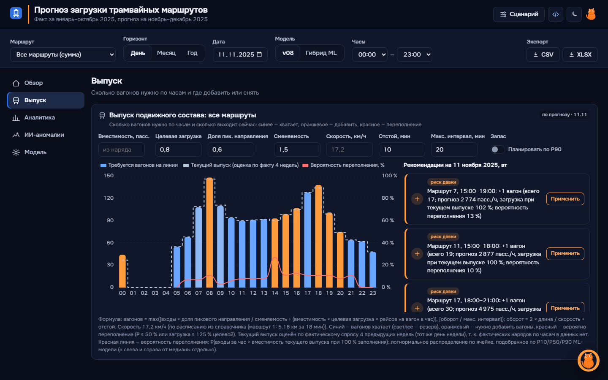
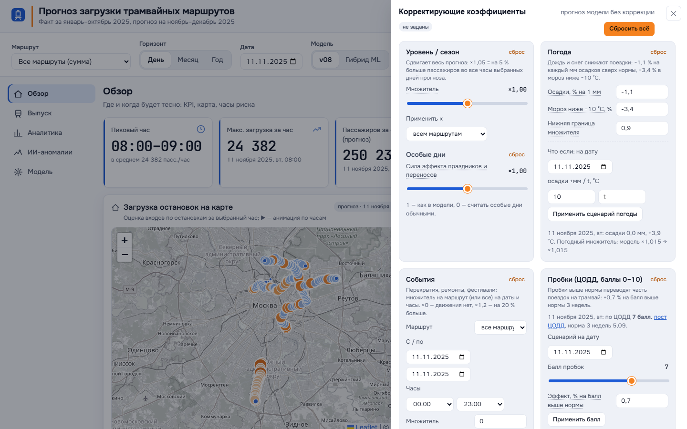
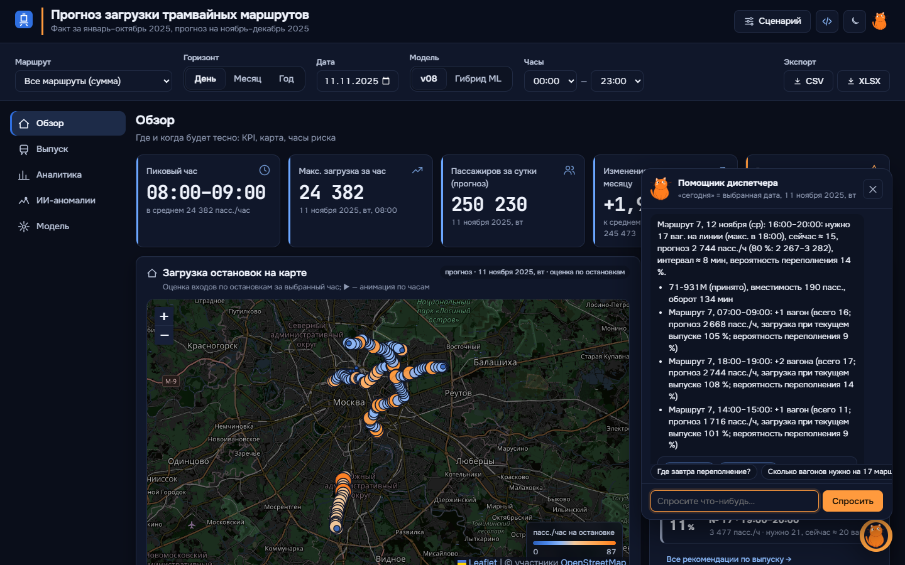

# Веб-сервис: прогноз загрузки трамваев

Дашборд и REST API для диспетчеров: где и когда будет тесно, сколько вагонов выпустить, что изменится при дожде, перекрытии или пробках.

## Запуск

```bash
docker compose up --build            # http://localhost:8000 — дашборд, /docs — Swagger
```

В `docker-compose.yml` заданы лимиты 2 vCPU / 2 ГБ и healthcheck (`/health`). Папка `data/` уже собрана, сервис самодостаточен.

Без Docker:

```bash
pip install -r requirements.txt
uvicorn app.main:app --port 8000 --workers 2
```

Тесты:

```bash
pip install -r requirements-dev.txt
pytest -q                            # 77 тестов, из них 13 браузерных (Playwright)
```

Пересборка пакета данных из прогноза: `python scripts/prepare_data.py`.

## Интерфейс

| Раздел | Что показывает |
|---|---|
| **Обзор** | KPI дня, карта загрузки остановок с анимацией по часам, блок «Внимание»: часы с риском переполнения и нужное число вагонов |
| **Выпуск** | вагоны по часам: нужно / сейчас, риск переполнения, рекомендации с кнопкой «Применить», план по P90 |
| **Аналитика** | день / месяц / год, интервал 80 %, тепловая карта день × час, таблица маршрутов, экспорт CSV и XLSX |
| **ИИ-аномалии** | дни с провалами, всплесками и нетипичным профилем с причиной |
| **Модель** | как считается прогноз, метрики по фолдам, источники данных |
| **Сценарий** | корректирующие коэффициенты: уровень, особые дни, погода, события, пробки — с пересчётом «было → стало» |
| **Помощник** | вопросы обычным языком: «сколько вагонов нужно на 17 маршруте завтра в 8 утра?»; распознанные параметры можно поправить и применить |

Светлая и тёмная темы, адаптивная вёрстка от 375 px, управление с клавиатуры, контраст текста не ниже 4,5 : 1.

| | |
|---|---|
|  |  |
|  |  |

## Архитектура

```
валидации (CSV, 10 ГБ)
   └─ src/pipeline_ingest.py   приём и нормализация (DuckDB)
   └─ src/pipeline_geo.py      геопривязка остановок, отчёт о качестве
   └─ src/make_final.py        модель «уровень × профиль» + календарь, погода, события
   └─ src/ml/                  интервалы P10–P90, детектор аномалий, гибрид
        ↓ scripts/prepare_data.py
service/data/                  прогноз, разложение, история, остановки, погода, пробки
   └─ app/                     FastAPI: данные в памяти (numpy), ответы за миллисекунды
   └─ static/                  дашборд: Leaflet + ECharts, без сборки
```

Сервис не хранит состояние, поэтому масштабируется горизонтально: несколько контейнеров за балансировщиком.

## API (`/api/v1`)

Ошибки возвращаются в едином формате `{"error": {"code", "message", "details"}}` с понятным сообщением на русском: 400 — неверное значение, 404 — неизвестный маршрут или остановка, 422 — неверный тип или диапазон.

| Метод | Параметры | Возвращает |
|---|---|---|
| `GET /routes` | — | маршруты, наличие истории и геометрии, дата запуска |
| `GET /stops` | `route` | остановки с координатами и долей посадок |
| `GET /forecast` | `route` (`7`, `7,11`, `all`), `date_from`, `date_to`, `hour_from`, `hour_to`, `granularity=hour\|day\|month` + коэффициенты | ряд прогноза, P10/P90, итоги «было → стало» |
| `GET /history` | те же | факт январь–октябрь 2025 |
| `GET /forecast/stop` | `stop_id` + период | оценка по остановке |
| `GET /map` | `route`, `date` | все остановки × 24 часа |
| `GET /kpi` | период | пиковый час, максимум, итог, изменение к прошлому месяцу |
| `GET /fleet` | `route`, `date`, вместимость, целевая загрузка, `plan_by=p50\|p90` | вагоны по часам, вероятность переполнения, рекомендации |
| `GET /scenario/year` | `route`, `growth`, `band` | сценарий на 2026 год по месяцам |
| `GET /explain` | `route`, `date` | разложение прогноза на множители |
| `GET /anomalies` | `route`, `date_from`, `date_to`, `kind` | найденные аномалии с причиной |
| `GET /traffic` | период | баллы пробок ЦОДД, норма, ссылка на пост |
| `POST /assistant/query` | `{"text": "..."}` | разобранный запрос `{route, date_from, date_to, hour_from, hour_to, intent}` и ответ |
| `GET /export` | `format=csv\|xlsx` + период + коэффициенты | файл прогноза |
| `GET /health`, `GET /metrics` | — | готовность, счётчики, задержки |

### Корректирующие коэффициенты

Работают во всех эндпоинтах прогноза. По умолчанию прогноз совпадает с моделью.

| Параметр | Пример | Смысл |
|---|---|---|
| `k_level` | `1.02` или `7:1.05,11:0.97` | уровень для всех или отдельных маршрутов |
| `k_special` | `0.5` | сила эффекта праздников: 1 — как в модели, 0 — игнорировать |
| `w_precip`, `w_cold` | `-0.011`, `-0.034` | влияние осадков (на мм) и мороза ниже −10 °C |
| `w_scenario` | `2025-12-10:10:-15` | «что если»: +10 мм осадков и −15 °C в эту дату |
| `k_event` | `7:2025-12-01:2025-12-07:0` | событие на маршруте и в даты: перекрытие ×0, фестиваль ×1,2 |
| `k_traffic`, `w_traffic` | `2025-12-11:9`, `0.007` | балл пробок ЦОДД на дату и эффект на балл выше нормы |

Пример:

```bash
curl "localhost:8000/api/v1/forecast?route=17&date_from=2025-12-10&date_to=2025-12-10&k_event=17:2025-12-10:2025-12-10:1.2"
```

## Производительность

Нагрузка — смесь запросов как у дашборда (`scripts/loadtest.py`, 30 с на прогон, 5 % заведомо неверных запросов). Сервис ограничен 2 CPU, 2 воркера uvicorn.

| Соединений | Запросов/с | p50, мс | p95, мс | p99, мс | Память |
|---|---|---|---|---|---|
| 16 | 2 230–2 670 | 5,7 | 9,8–17,4 | 13,6–25,5 | ≈ 340–375 МБ |
| 64 | 2 280–2 530 | 24,4 | 37,2–63,1 | 64–88 | ≈ 375–410 МБ |
| 256 | 1 986 | 82,1 | 274 | 447 | 484 МБ |

Ошибок сервера нет. Измерено на хосте (Intel Core Ultra 5, Python 3.12) с привязкой процесса к 2 ядрам — тот же бюджет CPU, что `cpus: 2` в контейнере. Замер в контейнере: `scripts/bench_docker.ps1`.

## Ограничения

- Загрузка по остановкам — оценка: валидации не содержат остановку, прогноз маршрута распределяется по весам остановок.
- Геометрия остановок есть для маршрутов 1, 5, 7, 11, 12; остальные показываются без карты.
- Текущий выпуск вагонов оценивается по фактической загрузке прошлых недель: нарядов депо в данных нет.
- Живой слой пробок TomTom включается после `python scripts/fetch_traffic.py` с ключом в `TOMTOM_API_KEY`.
- Подложка карты и библиотеки графиков загружаются из интернета.
