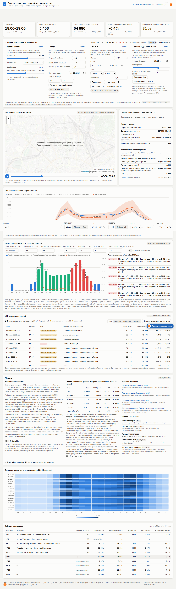
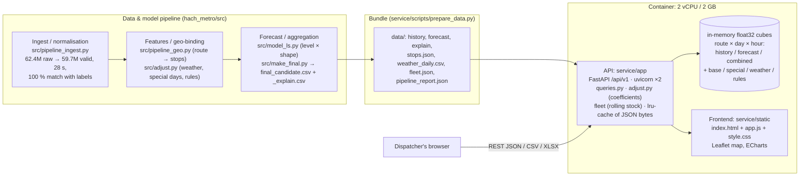
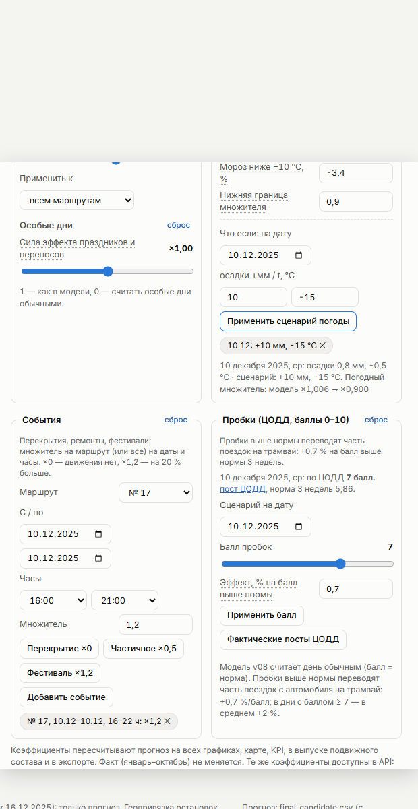
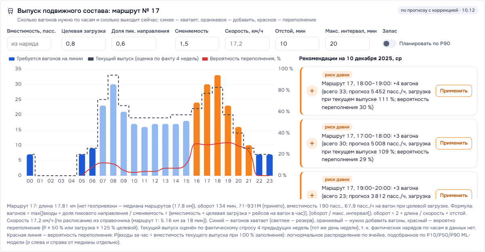
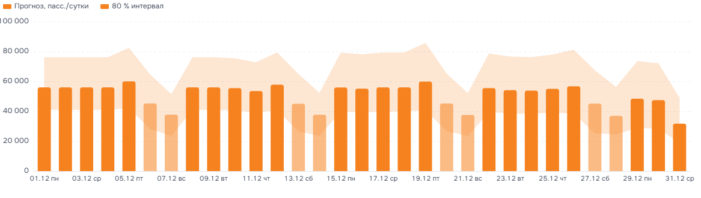
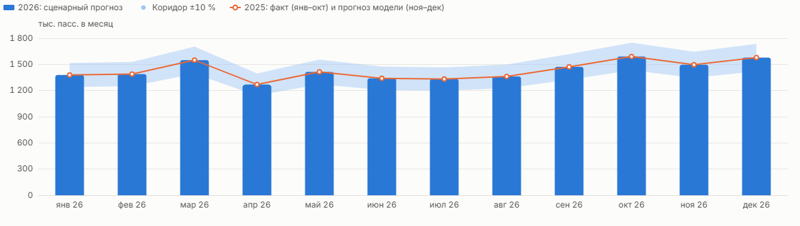

# Tram load forecast service (Moscow)

A web service and dashboard for Moscow dispatchers. It shows the forecast of tram passenger load (boardings/validations) for the 10 target routes, by route, by stop and by hour, on a Moscow map. A dispatcher can set **correction coefficients** (weather, events, season/level, special days) and see the forecast recomputed on the spot. The **rolling-stock panel** turns the forecast into the number of trams needed per hour and one-line recommendations.

Stack: FastAPI with in-memory numpy cubes, plus one static page (Leaflet + ECharts) served by the same process, in one container (2 vCPU / 2 GB).

- Dashboard: `http://localhost:8000/`. Swagger / OpenAPI: `http://localhost:8000/docs`
- Data: actuals Jan–Oct 2025 (`labels_day_*`); forecast Nov–Dec 2025 `submissions/final_candidate.csv` (v08, public LB 0.90167) with its decomposition `final_candidate_explain.csv` (`base × special_mult × weather_mult × rules_mult`); daily Moscow weather `research/weather_moscow_2025.csv`



## Run

```bash
# 1) (optional) rebuild the data bundle from the workspace; service/data/ is committed and self-contained
python scripts/prepare_data.py            # ../submissions/final_candidate.csv + _explain.csv, weather, stops, fleet

# 2) Docker: 2 vCPU / 2 GB limits are set in docker-compose.yml
docker compose up --build                 # -> http://localhost:8000

# 3) Without Docker
pip install -r requirements.txt
uvicorn app.main:app --port 8000 --workers 2
```

| Env variable | Default | Meaning |
|---|---|---|
| `FORECAST_PATH` | `data/forecast.csv` | forecast `route;date;hour;prediction` |
| `EXPLAIN_PATH` | `data/explain.csv` | decomposition `route;date;hour;base;special_mult;weather_mult;rules_mult;prediction;note`. Optional: without it, the explain panel is hidden and the special/weather corrections have nothing to rescale |
| `HISTORY_PATH`, `STOPS_PATH`, `ROUTE_NAMES_PATH`, `PIPELINE_REPORT_PATH`, `DATA_DIR` | `data/…` | actuals, stops, names, data-quality report, bundle folder (`weather_daily.csv`, `fleet.json`) |
| `WORKERS` | `2` | uvicorn workers (1 per vCPU gave the best p95) |
| `TRACKED_ROUTES` | `1,5,7,11,12,17,25,26,28,50` | the 10 target routes. Directory-only routes (2, 3, 4, 6, 10) are hidden everywhere |

Tests: `pip install -r requirements-dev.txt && pytest -q` → **31 passed**. They cover valid requests, corrections, rolling stock, the year scenario, export, and 4xx errors with Russian messages.

## Architecture



- At startup each worker loads about 90k rows into dense `float32` cubes. Every query is a numpy slice + multiply (corrections) + reduce, so it is O(requested cells).
- Serialized responses are cached (`lru_cache`, 4096 keys). The correction parameters are part of the key (a frozen dataclass). The data is immutable after startup.
- The metrics middleware is pure ASGI. GZip is on for responses > 2 KB. Access log is off.

## API (`/api/v1`)

Errors always have the same shape: `{"error": {"code", "message", "details"}}`, with a human-readable Russian `message`. Status codes: 400 for a wrong value (date, period, coefficient format), 404 for an unknown route or stop, 422 for a type or range violation.

| Endpoint | Key parameters | Returns |
|---|---|---|
| `GET /routes` | — | the 10 target routes, names, `has_history`, `has_geometry`, `launch_date` (route 5 = 2025-12-16), coverage |
| `GET /stops` | `route` | stops with coordinates, direction, share of route boardings; polylines |
| `GET /forecast` | `route` (`7`, `7,11`, `all`), `date_from`, `date_to`, `hour_from`, `hour_to`, `granularity=hour\|day\|month`, **+ corrections** | series + summary. With corrections: `adjusted`, `delta` (было → стало), `baseline.values` |
| `GET /history` | same (no corrections: actuals are never modified) | actuals Jan–Oct 2025 |
| `GET /series` | `source=history\|forecast\|combined` + the above | one series |
| `GET /forecast/stop` | `stop_id` + period + corrections | stop-level estimate |
| `GET /map` | `route`, `date`, `source` + corrections | every stop × 24 hourly values (the dashboard animates hours on the client) |
| `GET /kpi` | period + `source` + corrections | peak hour, max hourly load, total, change vs previous month (a single day is compared with the same weekday), `delta` |
| `GET /fleet` | `route`, `date`, `capacity`, `load_target` (0.8), `peak_share` (0.6), `turnover` (1.5), `speed` (17.2 km/h), `layover` (10), `max_headway` (20), `plan`, `min_boardings` (30) + corrections | trams needed per hour vs current supply, risk / surplus status, recommendations |
| `GET /scenario/year` | `route`, `growth` (%), `band` (±%, 10) + corrections | **scenario forecast** Jan–Dec 2026 by month with low/high |
| `GET /weather` | `date_from`, `date_to` + weather corrections | precipitation, temperature, weather multiplier (model vs corrected) |
| `GET /explain` | `route`, `date` | per hour: base, special/weather/rules multipliers, prediction, note |
| `GET /export` | `format=csv\|xlsx`, `source=forecast\|history\|combined\|scenario`, period, granularity + corrections | file. With corrections it gets two columns, «с коррекцией» and «Прогноз модели». The XLSX has a «Параметры» sheet listing the applied coefficients |
| `GET /pipeline/report` | — | data-quality report |
| `GET /health`, `GET /metrics` | — | readiness, data bundle; per-worker counters, latency histogram, cache hits |

### Correction coefficients (criterion 2c): also API parameters

| Parameter | Example | Meaning (default = the model) |
|---|---|---|
| `k_level` | `1.02` or `7:1.05,11:0.97` | level/season multiplier for all or for chosen routes |
| `k_special` | `0.5` | strength of special-day effects: `special' = 1 + k·(special − 1)` (1 = model, 0 = ignore holidays) |
| `w_precip` | `-0.011` | effect per 1 mm of precipitation over 06–21 h (−1.1 %/mm) |
| `w_cold` | `-0.034` | cold day (mean t < −10 °C): −3.4 % |
| `w_floor` | `0.9` | lower bound of the weather multiplier (upper bound 1.05) |
| `w_scenario` | `2025-12-10:10:-15` | what-if weather: +10 mm and −15 °C on that date (several items separated by `;`) |
| `k_event` | `7:2025-12-01:2025-12-07:0` · `all:2025-12-20:2025-12-20:1.2:16-21` | event on a route (or `all`) for a date range and optional hours: closure ×0, festival ×1.2 |

The corrected forecast is `prediction × k_level × special'/special × weather'/weather_mult × Π k_event`, where `weather' = clip(exp(w_precip·(precip − ref) + w_cold·[t < −10]), w_floor, 1.05)` and `ref` is the mean precipitation of 18–31 Oct (the same as `src/adjust.py`). With the default values every ratio is 1: the recomputed weather matches `weather_mult` in the file within 0.0005.

```bash
curl "localhost:8000/api/v1/forecast?route=7&date_from=2025-12-01&date_to=2025-12-07&granularity=day&k_level=1.1"
# ... "adjusted":true,"delta":{"total_before":173656.0,"total_after":191021.6,"abs":17365.6,"pct":10.0} ...
curl "localhost:8000/api/v1/fleet?route=17&date=2025-12-10&k_event=17:2025-12-10:2025-12-10:1.2:16-21"
# "recommendations":[{"text":"Маршрут 17, 18:00–19:00: +4 вагона (всего 33; прогноз 5 452 пасс./ч, загрузка при текущем выпуске 111 %)", ...
curl "localhost:8000/api/v1/forecast?route=7&k_event=7:2025-12-01"
# 400 {"error":{"code":"invalid_adjustment","message":"k_event: формат «маршрут:с:по:множитель[:час-час]», например 7:2025-12-01:2025-12-07:0",...}}
curl "localhost:8000/api/v1/forecast?hour_from=abc"
# 422 {"error":{"code":"validation_error","message":"Параметр «hour_from» должен быть целым числом",...}}
```

## Dashboard

- **Filters** (sticky): route (the 10 target routes or all), horizon **День / Месяц / Год**, date / month, hours, CSV/XLSX export of exactly what is on screen, corrections included.
- **KPIs**: «Пиковый час», «Макс. загрузка за час», passengers for the period (with «было → стало» when corrections are on; in year view, the 2026 scenario total with its band), «Изменение к прошлому месяцу».
- **«Корректирующие коэффициенты»** (collapsible): a level/season slider (all routes or the selected one), a special-days slider, weather coefficients plus a per-date what-if (+mm, t °C), and an events editor (route, dates, hours, presets «Перекрытие ×0», «Частичное ×0,5», «Фестиваль ×1,2»). The header shows **было → стало** for the selected period. The equivalent API query string is shown below the panel. Weather for the date: model multiplier → corrected multiplier.

  
- **«Выпуск подвижного состава»**: the hourly forecast turned into trams needed on the line. Bars are **red** where overcrowding is a risk (more trams needed than the current supply) and **green** where there is spare capacity. The dashed step is the current supply. Recommendations read like «Маршрут 17, 18:00–19:00: +4 вагона …». Every assumption can be edited.

  
- **Map**: stops coloured and sized by estimated boardings for the selected hour, with a slider and ▶ animation. Routes 17, 25, 26, 28 and 50 have no stop geometry: the map says «геопривязка остановок недоступна для маршрута», and these routes stay in the charts and tables. Route 5 is new: stops are shown, and before 16.12 a «запуск» overlay appears.
- **Horizons**:
  - День: hourly forecast vs the last actual day with the same weekday, plus the model forecast as a dashed line when corrections are on.
  - Месяц: daily totals for the month (weekends lighter).
  - Год: **сценарный прогноз** for Jan–Dec 2026 with a ±band and the 2025 line (actual + forecast).

   
- Heatmap day × hour, top-10 stops, «Качество данных» (62.4M → 59.7M, 28 s, 100 % match), «Из чего складывается прогноз» (Russian names of the explain factors plus the model note), route table, light/dark theme, mobile layout (390 px, no horizontal scroll).

All screenshots are in `docs/screenshots/`. To regenerate them: `python scripts/screenshots.py http://localhost:8000`.

### Method notes

- **Rolling stock** (`/fleet`):
  - Trams needed per hour = `max(⌈boardings × peak_share ÷ turnover ÷ (capacity × load_target × trips_per_vehicle_per_hour)⌉, ⌈round_trip ÷ max_headway⌉)`, with `round_trip = 2 × length ÷ speed + layover`.
  - Capacity comes from the vehicle class in the «Наряд» sheet: ОБК (71-931М) = 190, БК = 140 passengers (≈5 people/m²). Routes that are not in the sheet default to 71-931М.
  - Speed is 17.2 km/h, taken from the «Расписание» sample (route 1: 5.16 km in 18 min).
  - Route length is computed from stop geometry × 1.15. Routes without geometry use the median length.
  - Hourly depot orders are not in the data, so the **current supply** is estimated as the requirement computed from the actual demand of the previous 4 weeks (same weekday). Recommendations are therefore "what changes compared with the recent regime". A known plan can be passed as `plan`.
- **Year = scenario, not the model.** The seasonal index of month *m* is the average day of *m* in 2025 (Jan–Oct actual, Nov–Dec the model forecast, corrections included) divided by the 2025 level. The 2026 forecast = level × index × (1 + growth) × days in the month. The band is ±10 % by default, which is about 1 − the model's LB score (0.90). Route 5 has no history, so it uses the network index and its own post-launch level.
- **Stop-level numbers are an estimate**: route forecast × stop share. The pipeline gives each stop an equal weight; transfer hubs get ×2 and the last stop of a direction ×0.1.

## Performance (measured)

**Measured on the host, not in Docker.** On the development machine Docker Desktop 4.60 crashes at startup, so the Docker engine never comes up: `initializing Inference manager: remove …\Docker\run\dockerInference: The file cannot be accessed by the system` (a stale socket file under a user profile with a Cyrillic path). I measured the same service with the same limit instead: uvicorn with 2 workers, with the whole process tree **pinned to 2 logical CPUs** (affinity 0x3, the same CPU budget as `cpus: 2`). CPU is sampled from process CPU time (200 % = both cores busy) and RAM is the working set of the tree. Host: Intel Core Ultra 5 225H (14 logical CPUs), 32 GB, Windows 11, Python 3.12. The load generator runs on the remaining cores.

Load: `scripts/loadtest.py`, closed loop, aiohttp, 30 s per run, a dashboard-like mix:
- 30 % `/forecast`, and 30 % of those carry correction coefficients (`k_level` / `k_event` / `w_scenario`)
- 15 % `/history`, 20 % `/kpi`, 15 % `/map`, 8 % `/forecast/stop`, 5 % `/fleet`, 2 % `/routes`
- 5 % intentionally invalid requests (they get 400)

| Run | Workers | Connections | RPS | p50 ms | p95 ms | p99 ms | CPU % avg / max (of 200 %) | RAM max | Errors |
|---|---|---|---|---|---|---|---|---|---|
| 2 CPU, 16 conn | 2 | 16 | **2 673** | 5.7 | **9.8** | 13.6 | 153 / 200 | 337 MB | 0 (5 % are the intended 400s) |
| 2 CPU, 64 conn | 2 | 64 | **2 532** | 24.4 | **37.2** | 64.0 | 150 / 200 | 376 MB | 0 |
| 2 CPU, 256 conn | 2 | 256 | **1 986** | 82.1 | **274.3** | 447.0 | 137 / 198 | 484 MB | 0 |

Raw results are in `docs/loadtest_r2_*.json` and `docs/sample_r2_*.json`. The CPU average includes the idle warm-up and cool-down seconds; while the load runs, CPU is at 185–200 %.

Against the requirement (hundreds of RPS, p95 < 200–300 ms, 2–4 vCPU / 2–4 GB):
- About **2.5–2.7k RPS** on 2 CPUs.
- **p95 is 10–37 ms** up to 64 concurrent connections. At 256 connections with the CPU saturated, p95 is 274 ms, inside the 300 ms bound.
- **RAM is under 0.5 GB** against the 2 GB limit.
- An earlier run with the simpler request mix (no corrections or fleet) gave 3.3–3.6k RPS, p95 13–45 ms.

Container benchmark for the jury (one command; it builds the image, starts it with the 2 vCPU / 2 GB limits, runs the same load at 16, 64 and 256 connections, and samples `docker stats` for CPU % and RAM):

```powershell
docker compose up -d --build          # limits: cpus 2, memory 2g (docker-compose.yml)
powershell -ExecutionPolicy Bypass -File scripts\bench_docker.ps1     # -> docs/loadtest_docker_*.json
# Linux/macOS: python scripts/loadtest.py --url http://127.0.0.1:8000 --duration 30 --procs 4 --conc 16 --container tram-forecast --name docker_64c
```

To fix Docker Desktop on the dev machine: quit it, delete `%LOCALAPPDATA%\Docker\run\dockerInference` and `userAnalyticsOtlpHttp.sock` (or turn off Docker Model Runner in settings), then start it again.

## Project layout

```
service/
  app/      main.py (routes, params), queries.py (series, KPI, map, fleet, year), adjust.py (correction coefficients),
            store.py (loading, cubes), errors.py (Russian JSON errors), metrics.py, config.py
  static/   index.html, app.js, style.css (no build step; Leaflet/ECharts from jsDelivr)
  data/     bundle: history, forecast (v08), explain, stops, weather_daily, fleet, pipeline report, meta
  scripts/  prepare_data.py, loadtest.py, bench_docker.ps1, bench_windows.ps1, screenshots.py
  tests/    pytest API tests (31)
  docs/     screenshots, raw load-test JSON
```

## Known gaps

- The container benchmark has not been run on the dev machine (Docker Desktop is broken; see above). The numbers above come from the host with 2 CPUs pinned.
- Stop-level values and the current tram supply are estimates: the data has no stop-level counts and no hourly depot orders.
- The map tiles and chart libraries are loaded from the internet (OSM, jsDelivr).
- `/metrics` counters are per worker process.
