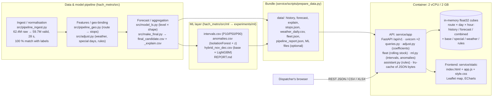
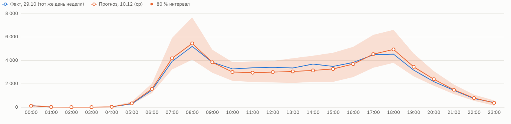
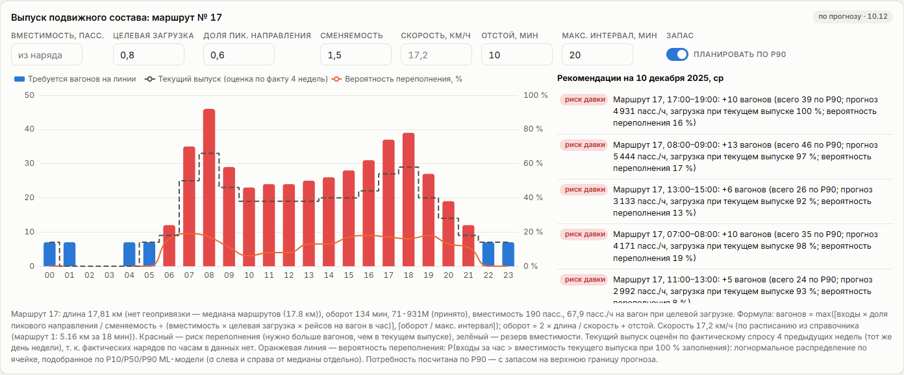
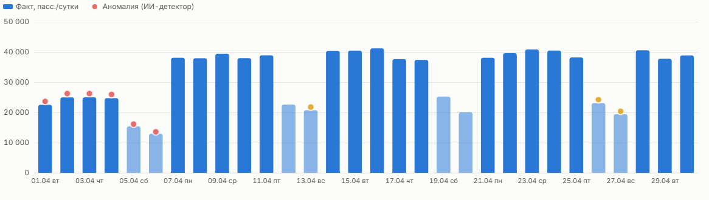
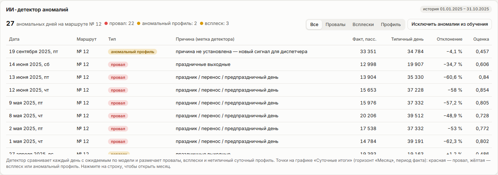
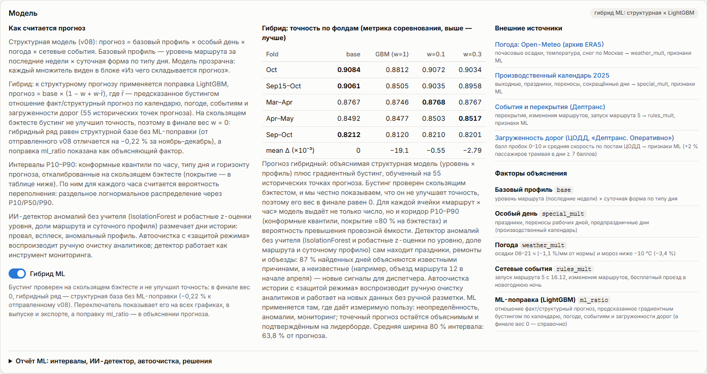
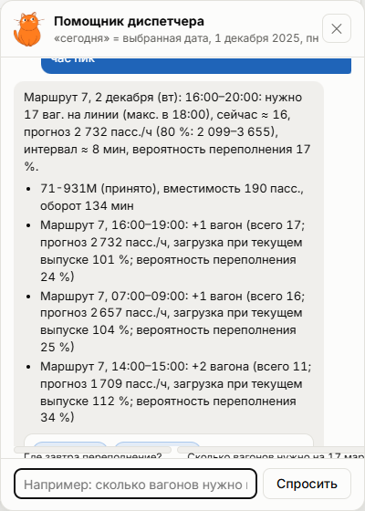
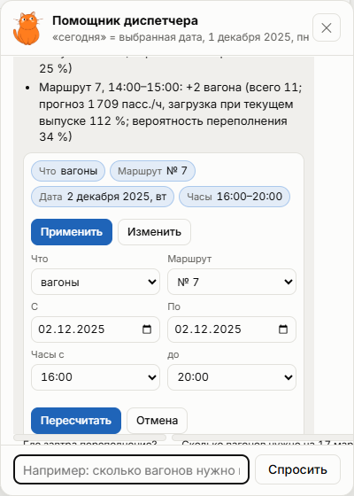
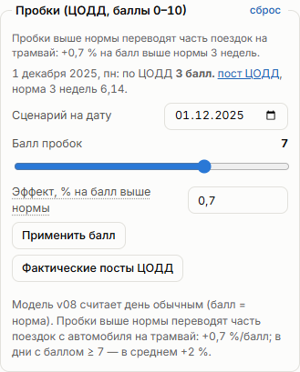

# Tram load forecast service (Moscow)

A web service and dashboard for Moscow dispatchers. It shows the forecast of tram passenger load (boardings/validations) for the 10 target routes, by route, by stop and by hour, on a Moscow map. A dispatcher can set **correction coefficients** (weather, events, season/level, special days) and see the forecast recomputed on the spot. The **rolling-stock panel** turns the forecast into the number of trams needed per hour and one-line recommendations.

Stack: FastAPI with in-memory numpy cubes, plus one static page (Leaflet + ECharts) served by the same process, in one container (2 vCPU / 2 GB).

- Dashboard: `http://localhost:8000/`. Swagger / OpenAPI: `http://localhost:8000/docs`
- **Round 4**: a «Пробки (ЦОДД)» correction coefficient and an optional live TomTom layer; the assistant turns free text into a structured query the dispatcher can edit and apply; loading and empty states with the cat mascot; design tokens with an AA contrast pass; a fix for charts that stayed blank after a hidden start.
- **AI/ML layer** (section «ИИ/ML-компоненты» below): 80 % prediction intervals and overflow probability, P90 fleet planning, an AI anomaly detector over the history, the «Модель» panel with fold metrics and a v08 ↔ hybrid toggle, and a rule-based «Помощник диспетчера».
- Data: actuals Jan–Oct 2025 (`labels_day_*`); forecast Nov–Dec 2025 `submissions/final_candidate.csv` (v08, public LB 0.90167) with its decomposition `final_candidate_explain.csv` (`base × special_mult × weather_mult × rules_mult`); daily Moscow weather `research/weather_moscow_2025.csv`


## Run

```bash
# 1) (optional) rebuild the data bundle from the workspace; service/data/ is committed and self-contained
python scripts/prepare_data.py            # ../submissions/final_candidate.csv + _explain.csv, weather, stops, fleet,
                                          # + ML layer from ../experiments/ml (intervals, anomalies, hybrid, REPORT.md)

# 2) Docker: 2 vCPU / 2 GB limits are set in docker-compose.yml
docker compose up --build                 # -> http://localhost:8000

# 3) Without Docker
pip install -r requirements.txt
uvicorn app.main:app --port 8000 --workers 2
```

| Env variable | Default | Meaning |
|---|---|---|
| `FORECAST_PATH` | `data/forecast.csv` | forecast `route;date;hour;prediction` |
| `EXPLAIN_PATH` | `data/explain.csv` | decomposition `route;date;hour;base;special_mult;weather_mult;rules_mult;prediction;note`. Optional: without it, the explain panel is hidden and the special/weather corrections have nothing to rescale |
| `HISTORY_PATH`, `STOPS_PATH`, `ROUTE_NAMES_PATH`, `PIPELINE_REPORT_PATH`, `DATA_DIR` | `data/…` | actuals, stops, names, data-quality report, bundle folder (`weather_daily.csv`, `fleet.json`) |
| `INTERVALS_PATH`, `ANOMALIES_PATH`, `HYBRID_PATH`, `HYBRID_FOLDS_PATH`, `MODEL_REPORT_PATH` | `data/intervals.csv`, `data/anomalies.csv`, `data/hybrid_nov_dec.csv`, `data/hybrid_folds.csv`, `data/model_report.md` | optional ML layer. Every file may be missing: the related feature reports «not available» and the service keeps working on v08 |
| `WORKERS` | `2` | uvicorn workers (1 per vCPU gave the best p95) |
| `TOMTOM_API_KEY` | — (read from the environment or the gitignored `service/.env`) | used **only** by `scripts/fetch_traffic.py` (live TomTom layer). The service itself never reads the key |
| `TRACKED_ROUTES` | `1,5,7,11,12,17,25,26,28,50` | the 10 target routes. Directory-only routes (2, 3, 4, 6, 10) are hidden everywhere |

Tests: `pip install -r requirements-dev.txt && pytest -q` → **67 passed** (3 of them are browser tests in `tests/test_ui_e2e.py`, skipped automatically when Playwright or Chrome is not installed; `tests/test_assistant.py` covers the query normaliser, POST `/assistant/query`, the ЦОДД coefficient and the TomTom script). They cover valid requests, corrections, rolling stock, the year scenario, export, and 4xx errors with Russian messages. `tests/test_ml.py` (9 tests) checks the AI/ML layer on small synthetic fixtures (intervals, hybrid, anomalies, report), so it does not depend on the real ML files. It also checks that every feature degrades cleanly when the files are absent.

## Docker (instructions for the jury)

```bash
cd service
docker compose up -d --build          # image with the data bundle; limits cpus: 2, memory: 2g; healthcheck on /api/v1/health
docker compose ps                     # STATUS must become "healthy" in ~15 s
open http://localhost:8000/           # dashboard;  http://localhost:8000/docs  — Swagger
docker stats tram-forecast            # CPU / RAM under the limits
powershell -ExecutionPolicy Bypass -File scripts\bench_docker.ps1   # optional: the same load test inside the limits
docker compose down
```

- The image is self-contained: `data/` (history, forecast, explain, stops, weather, ЦОДД traffic, fleet, ML files) is copied in. No internet is needed at runtime except for map tiles and the chart library CDN in the browser.
- **Docker could not be run on the development machine.** Docker Desktop 4.60 fails to start under a Windows user profile with a Cyrillic path: it cannot create its unix sockets (`…\AppData\Local\Docker\run\dockerInference: The file cannot be accessed by the system`). The Dockerfile and compose file were reviewed. The performance numbers below come from the host with the same 2-CPU budget (process tree pinned to 2 logical CPUs). On a machine with a Latin user path, or on Linux/macOS, the commands above work as is.

## Architecture



- At startup each worker loads about 90k rows into dense `float32` cubes. Every query is a numpy slice + multiply (corrections) + reduce, so it is O(requested cells).
- Serialized responses are cached (`lru_cache`, 4096 keys). The correction parameters are part of the key (a frozen dataclass). The data is immutable after startup.
- The metrics middleware is pure ASGI. GZip is on for responses > 2 KB. Access log is off.

## API (`/api/v1`)

Errors always have the same shape: `{"error": {"code", "message", "details"}}`, with a human-readable Russian `message`. Status codes: 400 for a wrong value (date, period, coefficient format), 404 for an unknown route or stop, 422 for a type or range violation.

| Endpoint | Key parameters | Returns |
|---|---|---|
| `GET /routes` | — | the 10 target routes, names, `has_history`, `has_geometry`, `launch_date` (route 5 = 2025-12-16), coverage |
| `GET /stops` | `route` | stops with coordinates, direction, share of route boardings; polylines |
| `GET /forecast` | `route` (`7`, `7,11`, `all`), `date_from`, `date_to`, `hour_from`, `hour_to`, `granularity=hour\|day\|month`, `model=v08\|hybrid`, **+ corrections** | series + summary. With corrections: `adjusted`, `delta` (было → стало), `baseline.values`. With intervals loaded: `p10`, `p90` on every point + `interval` (level 0.8, method) |
| `GET /history` | same (no corrections: actuals are never modified) | actuals Jan–Oct 2025 |
| `GET /series` | `source=history\|forecast\|combined` + the above | one series (`p10`/`p90` on forecast days) |
| `GET /forecast/stop` | `stop_id` + period + corrections | stop-level estimate |
| `GET /map` | `route`, `date`, `source` + corrections | every stop × 24 hourly values (the dashboard animates hours on the client) |
| `GET /kpi` | period + `source` + corrections | peak hour, max hourly load, total, change vs previous month (a single day is compared with the same weekday), `delta` |
| `GET /fleet` | `route`, `date`, `capacity`, `load_target` (0.8), `peak_share` (0.6), `turnover` (1.5), `speed` (17.2 km/h), `layover` (10), `max_headway` (20), `plan`, `min_boardings` (30), **`plan_by=p50\|p90`** + corrections | trams needed per hour vs current supply, risk / surplus status, recommendations. With intervals: per hour `p_overflow`, `boardings_p10/p90`; top-level `overflow` {max, route, hour} |
| `GET /scenario/year` | `route`, `growth` (%), `band` (±%, 10) + corrections | **scenario forecast** Jan–Dec 2026 by month with low/high |
| `GET /weather` | `date_from`, `date_to` + weather corrections | precipitation, temperature, weather multiplier (model vs corrected) |
| `GET /explain` | `route`, `date` | per hour: base, special/weather/rules multipliers, prediction, note |
| `GET /export` | `format=csv\|xlsx`, `source=forecast\|history\|combined\|scenario`, period, granularity + corrections | file. With corrections it gets two columns, «с коррекцией» and «Прогноз модели». The XLSX has a «Параметры» sheet listing the applied coefficients |
| `GET /pipeline/report` | — | data-quality report |
| `GET /traffic` | `date_from`, `date_to` + corrections | ЦОДД road load per day: score 0–10 (no post = 4), 3-week norm, permalink to the post, multiplier under the given `k_traffic` |
| `GET /traffic/live` | — | live TomTom snapshot near stops (`available:false` until `scripts/fetch_traffic.py` has run with a working key) |
| `POST /assistant/query` | JSON `{text, ref_date?, plan_by?, query?}` + corrections, `model` | free text → **structured query** `{route, date_from, date_to, hour_from, hour_to, hour_ranges, granularity, corrections, intent}` + recognised chips + answer. Send an edited `query` to override the parse (Russian 400/422 on bad dates/hours) |
| `GET /anomalies` | `route`, `date_from`, `date_to`, `kind=drop\|spike\|shape` | AI anomaly detector events: date, kind (провал / всплеск / аномальный профиль), Russian cause label, score, actual vs typical day, deviation %; `by_kind`, `training_note`. `available: false` without `anomalies.csv` |
| `GET /model` | — | «Модель» panel: description, REPORT.md tables (fold metrics, intervals, detector, decisions), external sources with links, explain factors, hybrid vs v08 totals, availability flags |
| `GET /assistant` | `q` (≤ 300 chars), `ref_date` («сегодня»), `plan_by` + corrections, `model` | «Помощник диспетчера»: parsed route / date / hour, intent, answer text, items, a dashboard `action` |
| `GET /health`, `GET /metrics` | — | readiness, data bundle, `ml` flags (intervals / hybrid / anomalies / report, load errors); per-worker counters, latency histogram, cache hits |

### Correction coefficients (criterion 2c): also API parameters

| Parameter | Example | Meaning (default = the model) |
|---|---|---|
| `k_level` | `1.02` or `7:1.05,11:0.97` | level/season multiplier for all or for chosen routes |
| `k_special` | `0.5` | strength of special-day effects: `special' = 1 + k·(special − 1)` (1 = model, 0 = ignore holidays) |
| `w_precip` | `-0.011` | effect per 1 mm of precipitation over 06–21 h (−1.1 %/mm) |
| `w_cold` | `-0.034` | cold day (mean t < −10 °C): −3.4 % |
| `w_floor` | `0.9` | lower bound of the weather multiplier (upper bound 1.05) |
| `w_scenario` | `2025-12-10:10:-15` | what-if weather: +10 mm and −15 °C on that date (several items separated by `;`) |
| `k_event` | `7:2025-12-01:2025-12-07:0` · `all:2025-12-20:2025-12-20:1.2:16-21` | event on a route (or `all`) for a date range and optional hours: closure ×0, festival ×1.2 |
| `k_traffic` | `2025-12-11:9` · `actual` | ЦОДД road-load score 0–10 on a date (several with `;`), or `actual` = the real ЦОДД posts for Nov–Dec. Multiplier `1 + w_traffic × (score − norm)`, where norm = mean of the 21 preceding days (no post = 4). v08 assumes a normal day |
| `w_traffic` | `0.007` | effect per point above the norm (confirmed +0.7 %/point, p = 0.025; editable 0–0.05) |

The corrected forecast is `prediction × k_level × special'/special × weather'/weather_mult × Π k_event`, where `weather' = clip(exp(w_precip·(precip − ref) + w_cold·[t < −10]), w_floor, 1.05)` and `ref` is the mean precipitation of 18–31 Oct (the same as `src/adjust.py`). With the default values every ratio is 1: the recomputed weather matches `weather_mult` in the file within 0.0005.

```bash
curl "localhost:8000/api/v1/forecast?route=7&date_from=2025-12-01&date_to=2025-12-07&granularity=day&k_level=1.1"
# ... "adjusted":true,"delta":{"total_before":173656.0,"total_after":191021.6,"abs":17365.6,"pct":10.0} ...
curl "localhost:8000/api/v1/fleet?route=17&date=2025-12-10&k_event=17:2025-12-10:2025-12-10:1.2:16-21"
# "recommendations":[{"text":"Маршрут 17, 18:00–19:00: +4 вагона (всего 33; прогноз 5 452 пасс./ч, загрузка при текущем выпуске 111 %)", ...
curl "localhost:8000/api/v1/forecast?route=7&k_event=7:2025-12-01"
# 400 {"error":{"code":"invalid_adjustment","message":"k_event: формат «маршрут:с:по:множитель[:час-час]», например 7:2025-12-01:2025-12-07:0",...}}
curl "localhost:8000/api/v1/forecast?hour_from=abc"
# 422 {"error":{"code":"validation_error","message":"Параметр «hour_from» должен быть целым числом",...}}
```

## Dashboard

- **Filters** (sticky): route (the 10 target routes or all), horizon **День / Месяц / Год**, date / month, hours, CSV/XLSX export of exactly what is on screen, corrections included.
- **KPIs**: «Пиковый час», «Макс. загрузка за час», passengers for the period (with «было → стало» when corrections are on; in year view, the 2026 scenario total with its band), «Изменение к прошлому месяцу».
- **«Корректирующие коэффициенты»** (collapsible): a level/season slider (all routes or the selected one), a special-days slider, weather coefficients plus a per-date what-if (+mm, t °C), and an events editor (route, dates, hours, presets «Перекрытие ×0», «Частичное ×0,5», «Фестиваль ×1,2»). The header shows **было → стало** for the selected period. The equivalent API query string is shown below the panel. Weather for the date: model multiplier → corrected multiplier.

  
- **«Выпуск подвижного состава»**: the hourly forecast turned into trams needed on the line. Bars are **red** where overcrowding is a risk (more trams needed than the current supply) and **green** where there is spare capacity. The dashed step is the current supply. Recommendations read like «Маршрут 17, 18:00–19:00: +4 вагона …». Every assumption can be edited.

  
- **Map**: stops coloured and sized by estimated boardings for the selected hour, with a slider and ▶ animation. Routes 17, 25, 26, 28 and 50 have no stop geometry: the map says «геопривязка остановок недоступна для маршрута», and these routes stay in the charts and tables. Route 5 is new: stops are shown, and before 16.12 a «запуск» overlay appears.
- **Horizons**:
  - День: hourly forecast vs the last actual day with the same weekday, plus the model forecast as a dashed line when corrections are on.
  - Месяц: daily totals for the month (weekends lighter).
  - Год: **сценарный прогноз** for Jan–Dec 2026 with a ±band and the 2025 line (actual + forecast).

   
- Heatmap day × hour, top-10 stops, «Качество данных» (62.4M → 59.7M, 28 s, 100 % match), «Из чего складывается прогноз» (Russian names of the explain factors plus the model note), route table, light/dark theme, mobile layout (390 px, no horizontal scroll).

All screenshots are in `docs/screenshots/`. To regenerate them: `python scripts/screenshots.py http://localhost:8000`.

### Method notes

- **Rolling stock** (`/fleet`):
  - Trams needed per hour = `max(⌈boardings × peak_share ÷ turnover ÷ (capacity × load_target × trips_per_vehicle_per_hour)⌉, ⌈round_trip ÷ max_headway⌉)`, with `round_trip = 2 × length ÷ speed + layover`.
  - Capacity comes from the vehicle class in the «Наряд» sheet: ОБК (71-931М) = 190, БК = 140 passengers (≈5 people/m²). Routes that are not in the sheet default to 71-931М.
  - Speed is 17.2 km/h, taken from the «Расписание» sample (route 1: 5.16 km in 18 min).
  - Route length is computed from stop geometry × 1.15. Routes without geometry use the median length.
  - Hourly depot orders are not in the data, so the **current supply** is estimated as the requirement computed from the actual demand of the previous 4 weeks (same weekday). Recommendations are therefore "what changes compared with the recent regime". A known plan can be passed as `plan`.
- **Year = scenario, not the model.** The seasonal index of month *m* is the average day of *m* in 2025 (Jan–Oct actual, Nov–Dec the model forecast, corrections included) divided by the 2025 level. The 2026 forecast = level × index × (1 + growth) × days in the month. The band is ±10 % by default, which is about 1 − the model's LB score (0.90). Route 5 has no history, so it uses the network index and its own post-launch level.
- **Stop-level numbers are an estimate**: route forecast × stop share. The pipeline gives each stop an equal weight; transfer hubs get ×2 and the last stop of a direction ×0.1.

## ИИ/ML-компоненты

The ML layer comes from `src/ml/` (ML engineer, report in `experiments/ml/REPORT.md` → `data/model_report.md`). The service reads it as optional files. Everything here is computed in-process from the bundle: no external LLM or API calls, no keys.

| Component | Where | How it works | Status of the ML run |
|---|---|---|---|
| **80 % interval** «80 % интервал» | day and month charts (shaded band), `/forecast`, `/series`, `/forecast/stop`, export (P10/P90 columns) | The interval is stored relative to the ML median (P10/P50, P90/P50), so the band follows whatever is shown: v08, hybrid, or a corrected forecast. Hours of one day and routes are summed as fully correlated. Days of a month are combined as independent (root of sum of squares): an hourly ±30 % does not turn into a ±30 % month | shipped: conformal quantiles ×1.15, coverage 78 % (82 % passenger-weighted) on 5 folds |
| **Вероятность переполнения** | 5th KPI tile, orange line in the fleet chart, `p_overflow` in `/fleet`, recommendation texts | P(boardings in the hour > what the current supply carries at 100 % of vehicle capacity). The capacity comes from the fleet panel (vehicle, turnover, peak share, trips per vehicle). A two-piece lognormal per cell is fitted through P10/P50/P90: σ_low = ln(P50/P10)/1.2816 and σ_high = ln(P90/P50)/1.2816, with the median = the shown forecast. If P10 = 0, the other side's σ is used | same method as `prob_exceed` in the ML report |
| **Планировать по P90** | switch in «Выпуск подвижного состава», `plan_by=p90` | The requirement is computed from P90 demand instead of the median, which leaves a buffer for the upper edge of the forecast | — |
| **ИИ-детектор аномалий** | panel «ИИ-детектор аномалий», red/amber dots on the «Месяц» history chart with a tooltip, `/anomalies` | Unsupervised (IsolationForest plus robust z-scores of level, route share and hourly profile) → drop / spike / shape with a cause. English labels are translated to Russian (the original is kept in `label_src`). The service adds actual vs typical day (median of the same weekday ±4 weeks). «Исключить аномалии из обучения» is informational: history is already cleaned (manual plus auto-clean with a regime guard) | 262 of 2,736 route-days flagged, 87 % explained by known causes. Monitoring tool, v08 unchanged |
| **Модель** | card «Модель» + filter «Модель: v08 / Гибрид ML» | Structural v08 (base × special × weather × rules) and the hybrid base × (1 − w + w·r̂) with LightGBM r̂. REPORT.md tables are rendered: fold metrics, interval methods, detector recall, auto-clean, decisions. External sources with links: Open-Meteo weather, production calendar, Дептранс closures/events, ЦОДД road load («Дептранс. Оперативно»). Explain factors including `ml_ratio`. The toggle switches every chart, KPI, fleet and export to `hybrid_nov_dec.csv` (`model=hybrid`) | LightGBM did not beat the base on the folds (−0.019), so **w = 0**. The hybrid series is the structural base, and the UI says so |
| **Помощник диспетчера** | floating button with the cat avatar, `POST /assistant/query` (and `GET /assistant`) | `app/nlq.py` turns the text into a structured query: typo repair, ё; «на 7-ке», «семерка», «семнадцатый трамвай»; «17-го», «семнадцатого», «третьего числа», «следующий понедельник», «с 10 по 15 декабря», «в декабре»; час пик = 07–10 **and** 16–20, or one of them for «утренний/вечерний»; ночью/утром/днём/вечером; corrections (+10 %, дождь N мм, мороз, перекрытие, фестиваль, пробки N баллов). The recognised parameters are shown as chips: «Изменить» edits them and re-asks, «Применить» sets route, date, hours and corrections on the dashboard. The chat stays open for follow-up questions. Earlier version: regex parsing of route (№ 17 / 17 маршрут), date (сегодня / завтра / weekday / «10 декабря» / 10.12 / ISO; «сегодня» = the date selected on the dashboard), hour («в 8 утра», «в 7 вечера», 18:00) and intent (переполнение, вагоны, пассажиры, час пик, аномалии, модель). It then calls the same query functions as the API. The «Показать на дашборде» button applies route, date and hour | rule-based, no LLM |












```bash
curl "localhost:8000/api/v1/forecast?route=17&date_from=2025-12-10&date_to=2025-12-10&hour_from=8&hour_to=8"
# "points":[{"ts":"2025-12-10T08:00","value":5444.0,"p10":...,"p90":...}], "interval":{"level":0.8,...}
curl "localhost:8000/api/v1/fleet?route=all&date=2025-12-10&plan_by=p90"      # "overflow":{"max":...,"route":"11","hour":16}
curl "localhost:8000/api/v1/anomalies?route=12&date_from=2025-04-01&date_to=2025-04-30"
curl "localhost:8000/api/v1/assistant?q=сколько вагонов нужно на 17 маршруте в 8 утра&ref_date=2025-12-10"
```

## Внешние источники

| Источник | Ссылка / способ получения | Признаки | Подтверждённый эффект |
|---|---|---|---|
| **Погода** | Open-Meteo archive API (используется): `archive-api.open-meteo.com/v1/archive?latitude=55.7558&longitude=37.6173&hourly=temperature_2m,precipitation,snowfall…`. Альтернативы: [Meteostat](https://meteostat.net), [rp5.ru](https://rp5.ru) | осадки 06–21 ч (мм), средняя температура, мороз < −10 °C, снег → `weather_mult` | OOS +0.0004…+0.003 на 3 из 4 фолдов; осадки −1,1 %/мм, мороз −3,4 % |
| **Производственный календарь** | Постановление Правительства РФ № 1335 (производственный календарь 2025; [КонсультантПлюс](https://www.consultant.ru/law/ref/calendar/proizvodstvennye/2025/)). Альтернативы: [xmlcalendar.ru](https://xmlcalendar.ru), [github.com/iposho/holidays-calendar-ru](https://github.com/iposho/holidays-calendar-ru), [calendar.kuzyak.in](https://calendar.kuzyak.in) | праздники, переносы, предпраздничные дни, школьные каникулы → `special_mult`, тип дня | +0.047 на фолде май–июнь; чистый уровень без школьных каникул +0.0049 на 6/6 фолдов |
| **События и перекрытия** | Дептранс: [t.me/s/DtOperativno](https://t.me/s/DtOperativno), [transport.mos.ru/mostrans/closures](https://transport.mos.ru/mostrans/closures); справочник GTFS организаторов (`spravochniki/*.xlsx`); API [data.mos.ru](https://data.mos.ru) | запуск маршрута 5 с 16.12, ремонты/объезды 7 и 50 по выходным, новогодняя ночь → `rules_mult`; корректировка `k_event` | LB +0.0043 (маршрут 5), +0.0064 (выходные 7/50), +0.0069 (с 15.11 + чистый уровень) |
| **Пробки** | ЦОДД — баллы 0–10 из постов [t.me/s/DtOperativno](https://t.me/s/DtOperativno) (используется: `research/traffic_moscow_2025*.csv`, скрипт `experiments/traffic/scrape_dtoperativno.py`); [TomTom Traffic API](https://developer.tomtom.com/traffic-api) — живой слой (нужен ключ, `scripts/fetch_traffic.py`) | балл дня, норма 3 недель → корректировка `k_traffic`; живая скорость у остановок | +2 % пассажиров в дни ≥ 7 баллов (p = 0,039); +0,7 %/балл к норме 3 недель (p = 0,025); OOS +0.0002…+0.0004 |

## Валидация

| Схема | Результат (метрика соревнования, выше — лучше) | Комментарий |
|---|---|---|
| Локальный hold-out: обучение январь–август → валидация сентябрь–октябрь | **0.821** | самый трудный фолд: смена режима после лета (возврат студентов, ремонты 50-го маршрута) |
| Фолд «октябрь» | **0.908** | ближайший к тестовому периоду режим |
| Среднее по 6 скользящим фолдам (rolling origin) | **≈ 0.87** | февраль, март, апрель, сентябрь, 15.09, октябрь |
| Публичный лидерборд (ноябрь–декабрь) | **0.90167** | финальный v08 |

Validation always predicts forward (rolling origin; train strictly before the fold). The ML components are checked on the same folds (see «ИИ/ML-компоненты»): the hybrid LightGBM gave −0.019 on average, so its weight is 0; the interval coverage is 78 %.

## Область определения и адаптации

- **Маршруты:** 1, 5, 7, 11, 12, 17, 25, 26, 28, 50. Маршрут 5 — новый (с 16.12.2025): уровень задан правилом, сезонность взята по сети.
- **Горизонты:** день (почасово), месяц (по дням), год (сценарный прогноз по месяцам с коридором).
- **Период:** январь–октябрь 2025 — факт; ноябрь–декабрь 2025 — прогноз; 2026 — сценарий.
- **Оценки, а не измерения:** загрузка по остановкам (прогноз маршрута × доля остановки) и текущий выпуск вагонов (по факту 4 предыдущих недель).
- **Новый маршрут:** нужны ≥ 4 недели факта по часам (уровень × форма), геометрия остановок (карта, длина), класс подвижного состава (вместимость); до этого — правило по аналогам и сетевая сезонность, как для маршрута 5.
- **Новый период:** прогноз погоды (осадки, температура), производственный календарь, список событий и перекрытий. Уровень пересчитывается по последним неделям факта.
- **Новый город:** заново оценить уровень × суточную форму на местных валидациях, собрать местный календарь, погоду и источник событий; эффекты погоды и пробок проверить на скользящих фолдах.
- **Ограничения:** в данных нет почасовых нарядов депо (текущий выпуск — оценка), нет посадок по остановкам (только маршрут), нет геометрии остановок для маршрутов 17, 25, 26, 28, 50 (карта для них недоступна, графики и таблицы работают).

## Performance (measured)

**Measured on the host, not in Docker.** On the development machine Docker Desktop 4.60 crashes at startup, so the Docker engine never comes up: `initializing Inference manager: remove …\Docker\run\dockerInference: The file cannot be accessed by the system` (a stale socket file under a user profile with a Cyrillic path). I measured the same service with the same limit instead: uvicorn with 2 workers, with the whole process tree **pinned to 2 logical CPUs** (affinity 0x3, the same CPU budget as `cpus: 2`). CPU is sampled from process CPU time (200 % = both cores busy) and RAM is the working set of the tree. Host: Intel Core Ultra 5 225H (14 logical CPUs), 32 GB, Windows 11, Python 3.12. The load generator runs on the remaining cores.

Load: `scripts/loadtest.py`, closed loop, aiohttp, 30 s per run, a dashboard-like mix:
- 30 % `/forecast`, and 30 % of those carry correction coefficients (`k_level` / `k_event` / `w_scenario`)
- 15 % `/history`, 20 % `/kpi`, 15 % `/map`, 8 % `/forecast/stop`, 5 % `/fleet`, 2 % `/routes`
- 5 % intentionally invalid requests (they get 400)

| Run | Workers | Connections | RPS | p50 ms | p95 ms | p99 ms | CPU % avg / max (of 200 %) | RAM max | Errors |
|---|---|---|---|---|---|---|---|---|---|
| 2 CPU, 16 conn | 2 | 16 | **2 673** | 5.7 | **9.8** | 13.6 | 153 / 200 | 337 MB | 0 (5 % are the intended 400s) |
| 2 CPU, 64 conn | 2 | 64 | **2 532** | 24.4 | **37.2** | 64.0 | 150 / 200 | 376 MB | 0 |
| 2 CPU, 256 conn | 2 | 256 | **1 986** | 82.1 | **274.3** | 447.0 | 137 / 198 | 484 MB | 0 |

Round 3 (AI/ML layer on: interval bands in `/forecast`, overflow probability in `/fleet`, same request mix), 2 CPUs pinned, 2 workers:

| Run | Connections | RPS | p50 ms | p95 ms | p99 ms | RAM max |
|---|---|---|---|---|---|---|
| r3, ML layer **off** (same session, A/B) | 64 | 2 426 | 22.6 | 61.8 | 89.0 | 382 MB |
| r3, ML layer **on** | 64 | 2 327 | 23.6 | 64.1 | 92.7 | 411 MB |
| r3, ML layer on | 16 | 2 300 | 5.7 | 16.6 | 24.3 | 373 MB |
| **r4** (ЦОДД coefficient, assistant, UI round 4) | 64 | 2 279 | 24.7 | **63.1** | 88.0 | 410 MB |
| **r4** | 16 | 2 230 | 5.8 | **17.4** | 25.5 | 374 MB |

The ML layer costs about 4 % at p95 in the same-session A/B (61.8 → 64.1 ms) and +29 MB RAM. In-process cost per request changes by less than 0.1 ms. The whole host was busier than in round 2: OneDrive was syncing and the ML jobs were running, and the no-ML baseline itself went from 37 to 62 ms at 64 connections. The absolute p95 values of round 3 are therefore not comparable with round 2; the A/B row is the fair comparison.

Round 4 (brief re-run, same host and mix) matches round 3 within noise: the new endpoints and the traffic coefficient add no measurable cost.

Raw results are in `docs/loadtest_r2_*.json`, `docs/loadtest_r3_*.json`, `docs/loadtest_r4_*.json` and the matching `docs/sample_*.json`. The CPU average includes the idle warm-up and cool-down seconds; while the load runs, CPU is at 185–200 %.

Against the requirement (hundreds of RPS, p95 < 200–300 ms, 2–4 vCPU / 2–4 GB):
- About **2.5–2.7k RPS** on 2 CPUs.
- **p95 is 10–37 ms** up to 64 concurrent connections. At 256 connections with the CPU saturated, p95 is 274 ms, inside the 300 ms bound.
- **RAM is under 0.5 GB** against the 2 GB limit.
- An earlier run with the simpler request mix (no corrections or fleet) gave 3.3–3.6k RPS, p95 13–45 ms.

Container benchmark for the jury (one command; it builds the image, starts it with the 2 vCPU / 2 GB limits, runs the same load at 16, 64 and 256 connections, and samples `docker stats` for CPU % and RAM):

```powershell
docker compose up -d --build          # limits: cpus 2, memory 2g (docker-compose.yml)
powershell -ExecutionPolicy Bypass -File scripts\bench_docker.ps1     # -> docs/loadtest_docker_*.json
# Linux/macOS: python scripts/loadtest.py --url http://127.0.0.1:8000 --duration 30 --procs 4 --conc 16 --container tram-forecast --name docker_64c
```

To fix Docker Desktop on the dev machine: quit it, delete `%LOCALAPPDATA%\Docker\run\dockerInference` and `userAnalyticsOtlpHttp.sock` (or turn off Docker Model Runner in settings), then start it again.

## Project layout

```
service/
  app/      main.py (routes, params), queries.py (series, KPI, map, fleet, year, anomalies, model), adjust.py (correction
            coefficients, model choice), ml.py (optional ML layer: intervals, anomalies, hybrid, report parsing, lognormal),
            assistant.py (rule-based «Помощник диспетчера»), store.py (loading, cubes), errors.py, metrics.py, config.py
  static/   index.html, app.js, style.css (no build step; Leaflet/ECharts from jsDelivr)
  data/     bundle: history, forecast (v08), explain, stops, weather_daily, fleet, pipeline report, meta,
            ML layer: intervals.csv, anomalies.csv, hybrid_nov_dec.csv, hybrid_folds.csv, model_report.md
  scripts/  fetch_traffic.py (TomTom live layer), prepare_data.py, loadtest.py, bench_docker.ps1, bench_windows.ps1, screenshots.py
  tests/    pytest API tests (32), AI/ML layer on synthetic fixtures (9), assistant + traffic (23), browser e2e (3)
  docs/     screenshots, raw load-test JSON
```

## Known gaps

- The container benchmark has not been run on the dev machine (Docker Desktop is broken; see above). The numbers above come from the host with 2 CPUs pinned.
- Stop-level values and the current tram supply are estimates: the data has no stop-level counts and no hourly depot orders.
- The map tiles and chart libraries are loaded from the internet (OSM, jsDelivr).
- `/metrics` counters are per worker process.
- `hybrid_nov_dec.csv` has `prediction = base = v08` (w = 0 chosen by cross-validation); the «Гибрид ML» toggle therefore shows the same numbers as v08, with `ml_ratio` as an explanatory column.
- «Помощник диспетчера» understands structured questions (route / dates / hours / corrections / one of six intents) with synonyms and typo repair. Anything else gets the help text with examples.
- TomTom: the configured key returns **HTTP 401** on every Traffic API endpoint (the key is probably not activated for Traffic Flow). `scripts/fetch_traffic.py` exits with code 2 and a Russian message, never prints the key and writes nothing, so the live map layer stays hidden. With a working key: `python scripts/fetch_traffic.py`, then restart the service.
